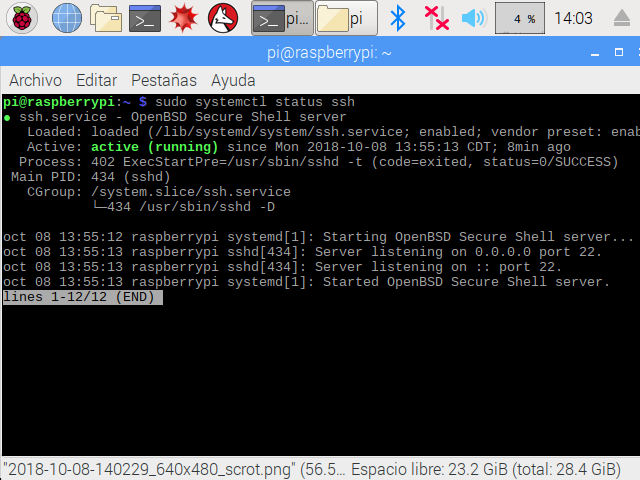
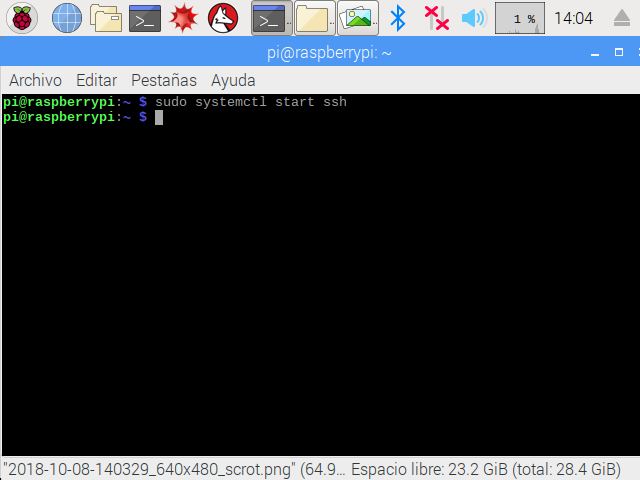
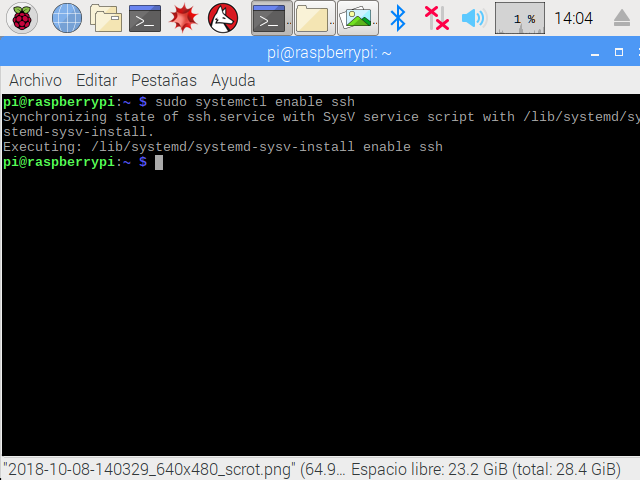
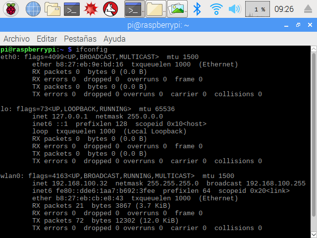

#			**INSTITUTO POLITECNICO NACIONAL.**</h1>

# 			  ESCUELA SUPERIOR DE CÓMPUTO.<h2>


#		 Título: Uso de las RaspberryPi 3.

					 Alumnos: 
				Angel Miranda Pedro.
				Gonzale Ambriz Luis Angel.

				Materia:  Embedded Systems.
		
				Grupo:    4CM3.
		
				Profesor: García Ortega Víctor Hugo.


SSH

Para verificar la  lista  de  servicios  disponible  y  su  estado ejecutamos los comandos siguientes podrás  observar  que  el  servicio  esta  activo  por  lo  que  ya se inicializo  .


```sh

$sudo  systemctl  status  ssh

```




```sh

$sudo  systemctl  start  ssh

```





```sh

$sudo  systemctl  enable  ssh

```





Verifica  el  nombre  de  la  interfaz  de  red  inalámbrica  en  tu  raspberry  y  anota  la  dirección  MAC.Ejecuta  el  comando:


```sh

$ifconfig

```





Determinar  la  dirección  ipasignada  por  el  router  WIFI  a  la  tarjeta  RaspberryPi  3.

Finalmente  ejecutar  la  conexión  con  el  comando  ssh.  Si  la  dirección  IP  asignada  a  nuestratarjeta  RaspberryPi  3  fuera 192.168.100.13 tendríamos:

```sh

$ssh pi@192.168.100.13

```

Usando la  RaspberryPi  3  mediante  VNC.


```sh

$sudo  systemctl  status  vncserver-x11-serviced

```

```sh

$sudo  systemctl  start  vncserver-x11-serviced

```

```sh

$sudo  systemctl  enable  vncserver-x11-serviced

```
 


```sh

$sudo  apt-get  install  realvnc-vnc-viewer

```


  Usando  la  RaspberryPi  3  mediante  consola.

```sh

$sudo  nano /boot/config.txt

```


Agregamos  al  final  las  sentencias  de  habilitación  del  mini-UART  y  la  configuración  de  suoscilador  de  250  Mhz  para  el  cálculo  de  la  velocidad  de  transmisión  en  baudios.

```sh

enable_uart=1
core_freq=250

```


En  nuestra  computadora  personal  conectamos  el  módulo  FT232  y  verificamos  el  nombre  dedispositivo  asignado,  normalmente  es  ttyUSB0.

```sh

$ls  -l  /dev/ttyUSB0

```


Verás  algo  como  esto:  “crw-rw----T  1  root  dialout  ...”,  la  letra  c  significa  que  es  un  dispositivode  carácter,  root  puede  leer  y  escribir,  el  grupo  dialout  puede  leer  y  escribir,  todos  los  demásno  tienen  acceso.  Debemos  ser  parte  del  grupo  dialout  para  poder  comunicarnos  con  elmódulo  FT232.
$ id
Si  no  aparece  el  grupo  dialout  en  la  lista  debemos  agregarnos  al  grupo  con:
$  sudo  usermod  -a  -G  dialout  “$(whoami)”

Entonces  podemos  conectar  nuestra  computadora  personal  con  GNU  screen.  Screen  es  unprograma  que  permite  administrar  ventanas  multiplexando  una  terminal  física  entre  variosprocesos.  Con  screen  podemos  realizar  la  conexión  a  nuestra  tarjeta  Raspberry  usando  lacomunicación  UART.  La  conexión  la  realizamos  con  el  comando  screen  epecificando  eldispositivo  al  que  nos  vamos  a  conectar  y  la  velocidad  de  comunicación:


```sh

$screen  /dev/ttyUSB0  11520

```
0


En  este  instante  tenemos  que  reniciar  nuestra  tarjeta  RaspberryPi  3.  
```sh

$sudo  reboot

```


